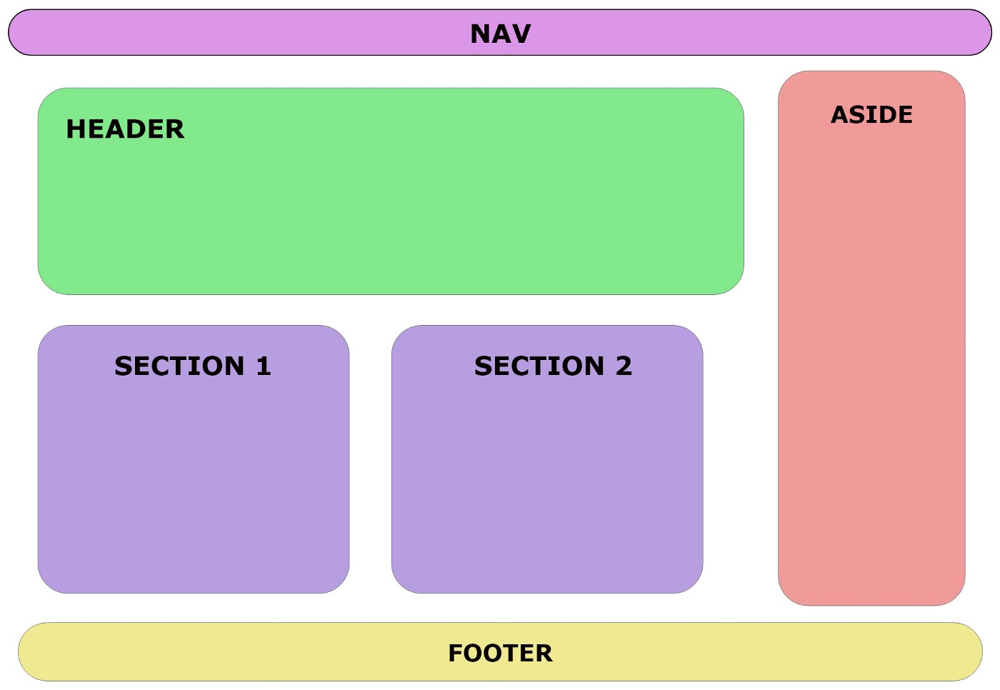

# Semantic Elements 🧩

" Semantic elements = elements with a meaning. "

> A semantic element clearly describes its meaning to both the browser and the developer.

> Examples of non-semantic elements: `<div>` and `<span>` - Tells nothing about its content.

> Examples of semantic elements: `<form>`, `<table>`, and `<article>` - Clearly defines its content.

<br>
<center>

</center>
<br>

## `<nav>` tag
>The `<nav>` tag is used for declaring the navigational section in HTML documents. Websites typically have sections dedicated to navigational links, which enables users to navigate the site. These links can be placed inside a nav tag. In other words, the nav element represents a section of the page whose purpose is to provide navigational links, either in the current document or to another document. The links in the nav element may point to other webpages or to different sections of the same webpage. It is a semantic element. Common examples of the nav elements are menus, tables, contents, and indexes.

Syntax:
```html
<nav> Links... </nav>
```

<br>

## `<header>` tag
>The `<header>` tag in HTML is used to define the header for a document or a section as it contains the information related to the title and heading of the related content. The `<header>` element is intended to usually contain the section’s heading (an h1-h6 element or an `<hgroup>` element), but this is not required. It can also be used to wrap a section’s table of contents, a search form, or any relevant logos. The `<header>` tag is a new tag in HTML5 and it is a container tag ie., it contains a starting tag, content & the end tag. There can be several `<header>` elements in one document. This tag cannot be placed within a `<footer>`,`<address>` or another `<header>` element.
Syntax:
```html
<header> ...</header>
```

<br>

<br>

## `<aside>` tag
>The `<aside>` tag is used to describe the main object of the web page in a shorter way like a highlighter. It basically identifies the content that is related to the primary content of the web page but does not constitute the main intent of the primary page. The `<aside>` tag contains mainly author information, links, related content, and so on.

Syntax:
```html
<aside>
  <h1>Contents...</h1>
  <p>Contents...</p>
</aside>
```

<br>

## `<section>` tag
> Section tag defines the section of documents such as chapters, headers, footers or any other sections. The section tag divides the content into section and subsections. The section tag is used when requirements of two headers or footers or any other section of documents needed. Section tag grouped the generic block of related contents. The main advantage of the section tag is, it is a semantic element, which describes its meaning to both browser and developer.

Syntax:
```html
<section> Section Contents </section>
```

<br>

## `<footer>` tag
> The <footer> tag in HTML is used to define a footer of HTML document. This section contains the footer information (author information, copyright information, carriers, etc). The footer tag is used within the body tag. The <footer> tag is new in the HTML5. The footer elements require a start tag as well as an end tag.

Syntax:
```html
<footer> ... </footer>
```

<br>

# CSS Properties

## {color} property
> CSS Color property is used to set the color of HTML elements. This property is used to set font color, background color etc.

Syntax:
```css
h1 {
    color: color-name;
}
```

### Built-In Color
> These are a set of predefined colors which are used by its name. For example: red, blue, green etc.

Example:
```css
h1 {
    color:green;
}
```

<br>

### RGB Format
> The RGB(Red, Green, Blue) format is used to define the color of an HTML element by specifying the R, G, B values range between 0 to 255. For example: RGB value of Red color is (255, 0, 0), Green color is (0, 255, 0), Blue color is (0, 0, 255) etc.

Example:
```css
h1{
    color: rgb(0, 153, 0);
    text-align:center;
}
```

<br>

### Hexadecimal Notation
> The hexadecimal notation begins with # symbol followed by 6 characters each range from 0 to F. For example: Red `#FF0000`, Green `#00FF00`, Blue `#0000FF` etc.

Example:
```css
 h1{
    color:#009900;
    text-align:center;
}
```
<br>

## {background} properties
> The CSS background properties are used to define the background effects for elements. There are lots of properties to design the background.

<br>

### Background color Property
> This property specifies the background color of an element. A color name can also be given as : “green”, a HEX value as “#5570f0”, an RGB value as “rgb(25, 255, 2)”.

Syntax:
```css
 body {
   background-color:color name
}
```

<br>

### Background Image Property
> This property specify an image to use as the background of an element. By default, the image is repeated so it covers the entire element.

Syntax:
```css
body {
   background-image : link;
}
```

<br>

### Background repeat Property
> By default the background image property repeats the image both horizontally and vertically.

Syntax:
```css
body {
   background-image:link;
   background-repeat: repeat:x;
}
```

<br>

### Background-attachment Property
> This property is used to fix the background ground image.The image will not scroll with the page.

Syntax:
```css
body {
   background-attachment: fixed;
}
```

<br>

### Background-position Property
> This property is used to set the image to a particular position. 

Syntax:
```css
body {
   background-repeat:no repeat;
   background-position:left top;
}
```

<br>

## {border} properties
> CSS border properties allow us to set the style, color, and width of the border.

Example:
```css
 h1 {
   border: 1px solid black;
}
```

<br>

### Border Radius

Syntax:
```css
 button {
   border-radius: 10px;
}
```

<br>

## {margin} properties
> CSS margins are used to create space around the element. We can set the different sizes of margins for individual sides(top, right, bottom, left).

Margin properties can have the following values:
* Length in cm, px, pt, etc.
* Width % of the element.
* Margin calculated by the browser: auto.

Syntax: 
```css
body{
    margin: size;
}
```

### {margin} individual properties
1 - margin-top: It is used to set the top margin of an element.

2 - margin-right: It is used to set the right margin of an element.

3 - margin-bottom: It is used to specify the amount of margin to be used on the bottom of an element.

4 - margin-left: It is used to set the width of the margin on the left of the desired element.

<br>

## {padding} properties
> CSS paddings are used to create space around the element, inside any defined border. We can set different paddings for individual sides(top, right, bottom, left). It is important to add border properties to implement padding properties.

Padding properties can have the following values: 

Length in cm, px, pt, etc.
Width % of the element.

Syntax:
```css
body{
    padding: size;
}
```

### {padding} individual properties
1 - padding-top: It is used to set the width of the padding area on the top of an element.

2 - padding-right: It is used to set the width of the padding area on the right of an element.

3 - padding-bottom: It is used to set the height of the padding area on the bottom of an element.

4 - padding-left: It is used to set the width of the padding area on the left of an element.

<br>

## {font-size} properties
> Set the font size for different elements.

```css
font-size:medium|xx-small|x-small|small|large|x-large|xx-large|smaller|larger|length|initial|inherit;
```

<br>

## {font-family} properties
> The font-family property specifies the font for an element.
> The font-family property can hold several font names as a "fallback" system. If the browser does not support the first font, it tries the next font.

```css
font-family: family-name|generic-family|initial|inherit;
```

<br>

## {font-weight} properties
> The font-weight property sets how thick or thin characters in text should be displayed.

```css
font-weight: normal|bold|bolder|lighter|number|initial|inherit;
```

<br>

Example: 
```html
<h5 style="font-weight: normal"> Font Weight Normal </h5>
<h5 style="font-weight: bold"> Font Weight Bold </h5>
<h5 style="font-weight: bolder"> Font Weight Bolder </h5>
<h5 style="font-weight: 100"> Font Weight 100 </h5>
<h5 style="font-weight: 200"> Font Weight 200 </h5>
<h5 style="font-weight: 300"> Font Weight 300 </h5>
<h5 style="font-weight: 400"> Font Weight 400 </h5>
<h5 style="font-weight: 500"> Font Weight 500 </h5>
<h5 style="font-weight: 600"> Font Weight 600 </h5>
<h5 style="font-weight: 700"> Font Weight 700 </h5>
<h5 style="font-weight: 800"> Font Weight 800 </h5>
<h5 style="font-weight: 900"> Font Weight 900 </h5>
<h5 style="font-weight: inherit"> Font Weight Inherit</h5>
```

Output:

<h5 style="font-weight: normal"> Font Weight Normal </h5>
<h5 style="font-weight: bold"> Font Weight Bold </h5>
<h5 style="font-weight: bolder"> Font Weight Bolder </h5>
<h5 style="font-weight: 100"> Font Weight 100 </h5>
<h5 style="font-weight: 200"> Font Weight 200 </h5>
<h5 style="font-weight: 300"> Font Weight 300 </h5>
<h5 style="font-weight: 400"> Font Weight 400 </h5>
<h5 style="font-weight: 500"> Font Weight 500 </h5>
<h5 style="font-weight: 600"> Font Weight 600 </h5>
<h5 style="font-weight: 700"> Font Weight 700 </h5>
<h5 style="font-weight: 800"> Font Weight 800 </h5>
<h5 style="font-weight: 900"> Font Weight 900 </h5>
<h5 style="font-weight: inherit"> Font Weight Inherit</h5>


<br>

## {font-style} properties
> The font-style property specifies the font style for a text.

```css
font-style: normal|italic|oblique|initial|inherit;
```

<br>

Example: 
```html
<h5 style="font-style: normal"> Font Style Normal </h5>
<h5 style="font-style: italic"> Font Style italic </h5>
<h5 style="font-style: oblique"> Font Style Oblique </h5>
<h5 style="font-style: initial"> Font Style Initial </h5>
<h5 style="font-style: inherit"> Font Style Inherit </h5>
```

Output:
<h5 style="font-style: normal"> Font Style Normal </h5>
<h5 style="font-style: italic"> Font Style italic </h5>
<h5 style="font-style: oblique"> Font Style Oblique </h5>
<h5 style="font-style: initial"> Font Style Initial </h5>
<h5 style="font-style: inherit"> Font Style Inherit </h5>

<br>

## Pseudo-Class
> A pseudo-class is used to define a special state of an element.

For example, it can be used to:
* Style an element when a user mouses over it;
* Style visited and unvisited links differently;
* Style an element when it gets focus.

Syntax
```css
selector:pseudo-class {
  property: value;
}
```

### {:hover} selector
> The `:hover` selector is used to select elements when you mouse over them.

Syntax
```css
:hover {
  css declarations;
}
```

<br>

### {::before} selector
> The `::before` selector inserts something before the content of each selected element(s).

Syntax
```css
::before {
  css declarations;
}

```

<br>

### {::after} selector
> The `::after` selector inserts something after the content of each selected element(s).

Syntax
```css
::after {
  css declarations;
}
```

<br>

# Practice 📝

<center>


</center>