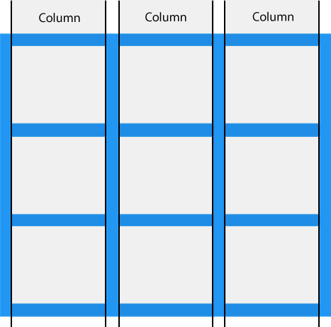

# Grid Layout 📏
> The CSS Grid Layout Module offers a grid-based layout system, with rows and columns, making it easier to design web pages without having to use floats and positioning.

<br> 

## Grid Elements
> A Grid Layout must have a parent element with the display property set to grid or inline-grid.
>
> Direct child element(s) of the grid container automatically becomes grid items.

Example:
```html
<div class="grid-container">
  <div class="grid-item">1</div>
  <div class="grid-item">2</div>
  <div class="grid-item">3</div>
  <div class="grid-item">4</div>
  <div class="grid-item">5</div>
  <div class="grid-item">6</div>
  <div class="grid-item">7</div>
  <div class="grid-item">8</div>
  <div class="grid-item">9</div>
</div>
```
<br>
Output:
<br>
<br>

<style>
.grid-container {
  display: grid;
  grid-template-columns: auto auto auto;
  background-color: #2196F3;
  padding: 10px;
}
.grid-item {
  background-color: rgba(255, 255, 255, 0.8);
  border: 1px solid rgba(0, 0, 0, 0.8);
  padding: 20px;
  font-size: 30px;
  text-align: center;
  color: black;
}
</style>
<div class="grid-container">
  <div class="grid-item">1</div>
  <div class="grid-item">2</div>
  <div class="grid-item">3</div>
  <div class="grid-item">4</div>
  <div class="grid-item">5</div>
  <div class="grid-item">6</div>
  <div class="grid-item">7</div>
  <div class="grid-item">8</div>
  <div class="grid-item">9</div>
</div>

<br>

## {display} property

> An HTML element becomes a grid container when its display property is set to grid or inline-grid.


Example:
```css
.grid-container {
  display: grid;
}
```
<br>

## Grid Columns
> The vertical lines of grid items are called columns.

<center>

</center>

<br>

## Grid Rows
> The horizontal lines of grid items are called rows.

<center>

</center>

<br>

## Grid Gaps
> The spaces between each column/row are called gaps.

<center>

</center>
<br>

> You can adjust the gap size by using one of the following properties:
> * column-gap
> * row-gap
> * gap

<br>

Example:
```css
.grid-container {
  display: grid;
  column-gap: 50px;
}
```
<br>

## Grid Lines
> The lines between columns are called column lines.

> The lines between rows are called row lines.

<center>

</center>
<br>


# Responsive Text

## Responsive Font Size with CSS Relative Lengths
| UNIT | DESCRIPTION                                                                              |
| :--: |:----------------------------------------------------------------------------------------:|
| em   | Relative to the font-size of the element (2em means 2 times the size of the current font)|
| ex   | Relative to the x-height of the current font (rarely used)                               |
| ch   | Relative to the width of the "0" (zero)                                                  |
| rem  | Relative to font-size of the root element                                                |
| vw   | Relative to 1% of the width of the viewport*                                             |
| vh   | Relative to 1% of the height of the viewport*                                            |
| vmin | Relative to 1% of viewport's* smaller dimension                                          |
| vmax | Relative to 1% of viewport's* larger dimension                                           |
| %    | Relative to the parent element                                                           |

<br>

# Practice 📝

<center>

</center>
<br>
