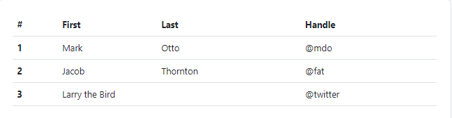

# Responsive Layout with Bootstrap
> Bootstrap is a powerful, feature-packed frontend toolkit. Build anything—from prototype to production—in minutes.

<center>

</center>
<br>

## `.container`
> Containers are the most basic layout element in Bootstrap and are required when using our default grid system. Containers are used to contain, pad, and (sometimes) center the content within them. While containers can be nested, most layouts do not require a nested container.

<center>

</center>
<br>

### `.container-fluid`
> Use .container-fluid for a full width container, spanning the entire width of the viewport.

```html
<div class="container-fluid">
  ...
</div>
```
<br>

Click here to more informations about [Bootstrap Container.](https://getbootstrap.com/docs/5.2/layout/containers/)

## Grid System
> Bootstrap’s grid system uses a series of containers, rows, and columns to layout and align content. It’s built with flexbox and is fully responsive. Below is an example and an in-depth explanation for how the grid system comes together.

```html
<div class="container text-center">
  <div class="row">
    <div class="col">
      Column
    </div>
    <div class="col">
      Column
    </div>
    <div class="col">
      Column
    </div>
  </div>
</div>
```

Output: 
<br>
<center>

</center>
<br>

Click here to more informations about [Bootstrap Grid System.](https://getbootstrap.com/docs/5.2/layout/grid/)

## Alerts
> Provide contextual feedback messages for typical user actions with the handful of available and flexible alert messages.

<br>
Example:

```html
<div class="alert alert-primary" role="alert">
  A simple primary alert—check it out!
</div>
<div class="alert alert-secondary" role="alert">
  A simple secondary alert—check it out!
</div>
<div class="alert alert-success" role="alert">
  A simple success alert—check it out!
</div>
<div class="alert alert-danger" role="alert">
  A simple danger alert—check it out!
</div>
<div class="alert alert-warning" role="alert">
  A simple warning alert—check it out!
</div>
<div class="alert alert-info" role="alert">
  A simple info alert—check it out!
</div>
<div class="alert alert-light" role="alert">
  A simple light alert—check it out!
</div>
<div class="alert alert-dark" role="alert">
  A simple dark alert—check it out!
</div>
```
<br>
Output: 
<br>
<center>

</center>
<br>

Click here to more informations about [Bootstrap Alert.](https://getbootstrap.com/docs/5.2/components/alerts/)

## Badges
> It's a small count and labeling component.Badges scale to match the size of the immediate parent element by using relative font sizing and em units. As of v5, badges no longer have focus or hover styles for links.

Example:

```html
<h1>Example heading <span class="badge bg-secondary">New</span></h1>
<h2>Example heading <span class="badge bg-secondary">New</span></h2>
<h3>Example heading <span class="badge bg-secondary">New</span></h3>
<h4>Example heading <span class="badge bg-secondary">New</span></h4>
<h5>Example heading <span class="badge bg-secondary">New</span></h5>
<h6>Example heading <span class="badge bg-secondary">New</span></h6>
```
<br>
Ouput:
<br>
<center>

</center>
<br>

Click here to more informations about [Bootstrap Badges.](http://https://getbootstrap.com/docs/5.2/components/badge/ "Bootstrap Badges")

<br>

## Buttons
> Bootstrap includes several predefined button styles, each serving its own semantic purpose, with a few extras thrown in for more control.

Example:
```html
<button type="button" class="btn btn-primary">Primary</button>
<button type="button" class="btn btn-secondary">Secondary</button>
<button type="button" class="btn btn-success">Success</button>
<button type="button" class="btn btn-danger">Danger</button>
<button type="button" class="btn btn-warning">Warning</button>
<button type="button" class="btn btn-info">Info</button>
<button type="button" class="btn btn-light">Light</button>
<button type="button" class="btn btn-dark">Dark</button>

<button type="button" class="btn btn-link">Link</button>
```
<br>
Ouput:
<br>
<center>

</center>
<br>

Click here to more informations about [Bootstrap Buttons.](https://getbootstrap.com/docs/5.2/components/buttons/)

<br>

## Cards
> A card is a flexible and extensible content container. It includes options for headers and footers, a wide variety of content, contextual background colors, and powerful display options. If you’re familiar with Bootstrap 3, cards replace our old panels, wells, and thumbnails. Similar functionality to those components is available as modifier classes for cards.

Example:
```html
<div class="card" style="width: 18rem;">
  
  <div class="card-body">
    <h5 class="card-title">Card title</h5>
    <p class="card-text">Some quick example text to build on the card title and make up the bulk of the card's content.</p>
    <a href="#" class="btn btn-primary">Go somewhere</a>
  </div>
</div>
```
<br>
Ouput:
<br>
<center>

</center>
<br>

Click here to more informations about [Bootstrap Cards.](https://getbootstrap.com/docs/5.2/components/card/)

<br>

## Typography
> Bootstrap sets basic global display, typography, and link styles. When more control is needed, check out the textual utility classes.

Heading Example:
```html
<h1>h1. Bootstrap heading</h1>
<h2>h2. Bootstrap heading</h2>
<h3>h3. Bootstrap heading</h3>
<h4>h4. Bootstrap heading</h4>
<h5>h5. Bootstrap heading</h5>
<h6>h6. Bootstrap heading</h6>
```
<br>
Ouput:
<br>
<center>

</center>
<br>

Display Example:
```html
<h1 class="display-1">Display 1</h1>
<h1 class="display-2">Display 2</h1>
<h1 class="display-3">Display 3</h1>
<h1 class="display-4">Display 4</h1>
<h1 class="display-5">Display 5</h1>
<h1 class="display-6">Display 6</h1>
```
<br>
Ouput:
<br>
<center>

</center>
<br>

Click here to more informations about [Bootstrap Typography.](https://getbootstrap.com/docs/5.2/content/typography/)

<br>

## List Group
> List groups are a flexible and powerful component for displaying a series of content. Modify and extend them to support just about any content within.

Example:
```html
<ul class="list-group">
  <li class="list-group-item">An item</li>
  <li class="list-group-item">A second item</li>
  <li class="list-group-item">A third item</li>
  <li class="list-group-item">A fourth item</li>
  <li class="list-group-item">And a fifth one</li>
</ul>
```
<br>
Ouput:
<br>
<center>

</center>
<br>

Click here to more informations about [Bootstrap Lists.](https://getbootstrap.com/docs/5.2/components/list-group/)

<br>

## Responsive Images
> Images in Bootstrap are made responsive with .img-fluid. This applies max-width: 100%; and height: auto; to the image so that it scales with the parent width.
 
Example:
```html

```
<br>
Ouput:
<br>
<center>

</center>
<br>

Click here to more informations about [Bootstrap Images.](https://getbootstrap.com/docs/5.2/content/images/#responsive-images)

<br>

## Tables
> Due to the widespread use of <table> elements across third-party widgets like calendars and date pickers, Bootstrap’s tables are opt-in. Add the base class .table to any <table>, then extend with our optional modifier classes or custom styles. All table styles are not inherited in Bootstrap, meaning any nested tables can be styled independent from the parent.
 
Example:
```html
<table class="table">
  <thead>
    <tr>
      <th scope="col">#</th>
      <th scope="col">First</th>
      <th scope="col">Last</th>
      <th scope="col">Handle</th>
    </tr>
  </thead>
  <tbody>
    <tr>
      <th scope="row">1</th>
      <td>Mark</td>
      <td>Otto</td>
      <td>@mdo</td>
    </tr>
    <tr>
      <th scope="row">2</th>
      <td>Jacob</td>
      <td>Thornton</td>
      <td>@fat</td>
    </tr>
    <tr>
      <th scope="row">3</th>
      <td colspan="2">Larry the Bird</td>
      <td>@twitter</td>
    </tr>
  </tbody>
</table>
```
<br>
Ouput:
<br>
<center>

</center>
<br>

### Variants
<br>
<center>

</center>
<br>

<br>
<center>

</center>
<br>


Click here to more informations about [Bootstrap Tables.](https://getbootstrap.com/docs/5.2/content/tables/)

<br>